# CodeLearning - E-learning platform for learning programming with automated code verification in isolated Docker containers

**CodeLearning** is a comprehensive Learning Management System (LMS) designed for programming education. It features a rich course structure (Theory, Video, Quizzes) and a **secure, isolated Code Runner** capable of executing and grading user code in real-time using Docker containers.

---

## Key Features

### User Roles & Permissions
The system implements Role-Based Access Control (RBAC) to distinguish between content creators and learners:
* **Teacher:** Has exclusive access to the **Creator Studio**. Can create courses, manage chapters, write theory (Markdown), upload videos, create quizes and design coding problems with custom test cases.
* **Student:** Can enroll in published courses, track progress, solve problems, and receive automated feedback from the runner.

### Learning Experience
* **Rich Content:** Support for Markdown-based theory, video lectures, and interactive quizzes.
* **Structured Learning:** Courses organized into Chapters, Subchapters, and learning Blocks.
* **Progress Tracking:** Detailed tracking of user progress through blocks and chapters.

### Interactive Code Runner
* **Multi-language Support:** At this moment, the system supports Python, C#, Java, JavaScript.
* **Sandboxed Execution:** User code runs in isolated Docker containers with no network access (`network: none`) and strict resource limits (CPU/RAM).
* **High Performance:** Utilizing **.NET Native AOT** for the internal TestRunner agent to minimize cold start times inside containers.
* **Real-time Feedback:** Immediate results on test cases (Input/Output comparison).

### Security & Architecture
* **Secure Authentication:** JWT-based auth with **HttpOnly Cookies**, Refresh Token Rotation, and server-side token blacklisting (Redis).
* **Microservices-ready:** Asynchronous communication between the API and the Runner service using **Redis Streams**.
* **Clean Architecture:** Separation of concerns in the backend (.NET) and modern signal-based state management in the frontend (Angular).

---

## Tech Stack

### Backend & DevOps
* **.NET 10:** API & Runner Service.
* **.NET Native AOT:** Used for the `TestRunner` agent (high-performance execution probe).
* **xUnit & Testcontainers:** For robust integration testing.
* **Docker Compose:** Orchestration of the entire stack.
* **Redis Streams:** Asynchronous task queue for code execution.
* **PostgreSQL:** Primary relational database (with JSONB support)

### Frontend
* **Angular 21:** Using modern features like **Signals** and Standalone Components.
* **Monaco Editor:** The code editor that powers VS Code, integrated for a coding experience.
* **Tailwind CSS:** For rapid and responsive UI development.

---

## Architecture

### System Overview
The system splits responsibilities between the REST API (User interaction) and the Execution Worker (Heavy lifting/Code running).

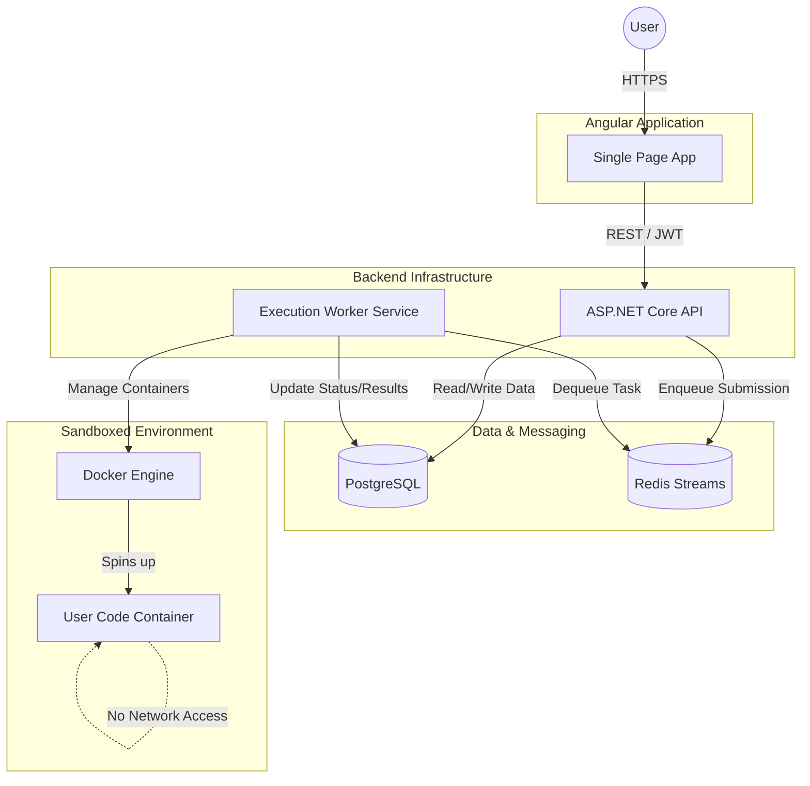

### Course Data Structure (ERD)
The content is organized hierarchically. `CourseBlock` uses polymorphism to support different content types (Theory, Video, Quiz, Problem) within the same list.

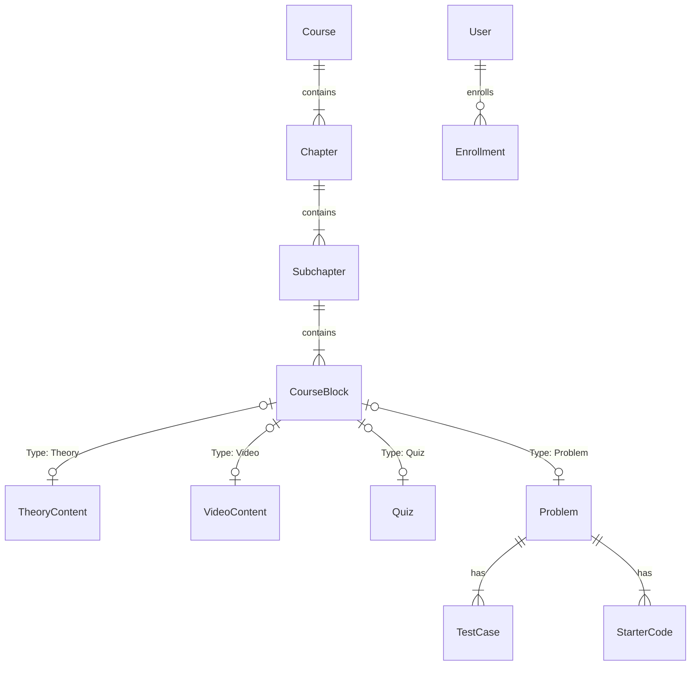

### Code Execution Pipeline
A detailed look at how a user's code is processed. The `Runner` service uses Docker to spin up a fresh environment for every submission, ensuring complete isolation.

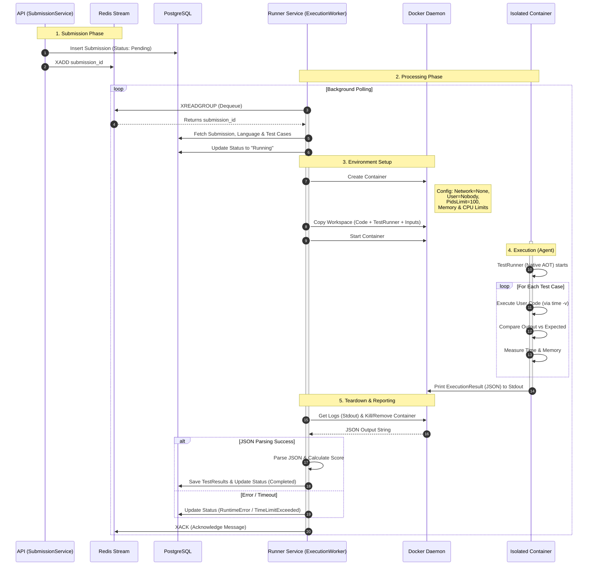

### Authentication Flow (Secure Cookie Strategy)
The system uses a "Silent Refresh" strategy. Tokens are stored in HttpOnly cookies, making them inaccessible to JavaScript (XSS protection). The frontend uses an Interceptor to automatically refresh tokens when a 401 error occurs.

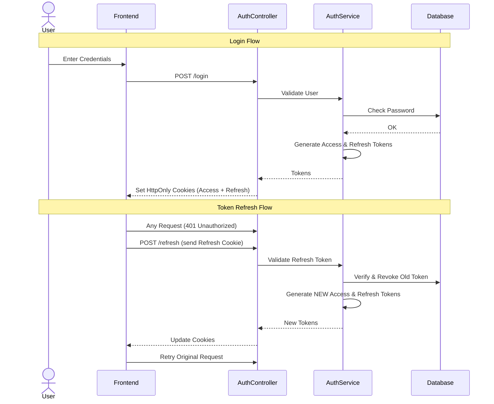

## Screenshots

Here are some screenshots of this appliaction.

### Dashboard

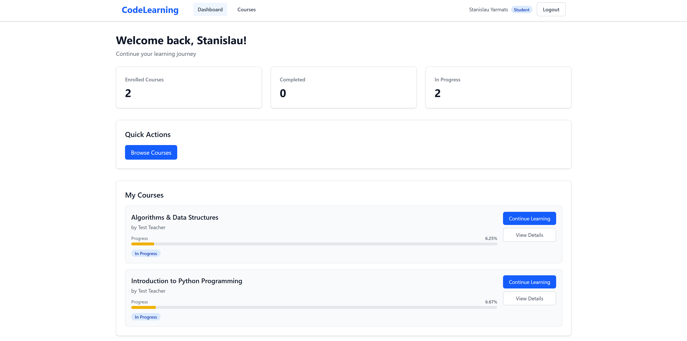

### Course Details
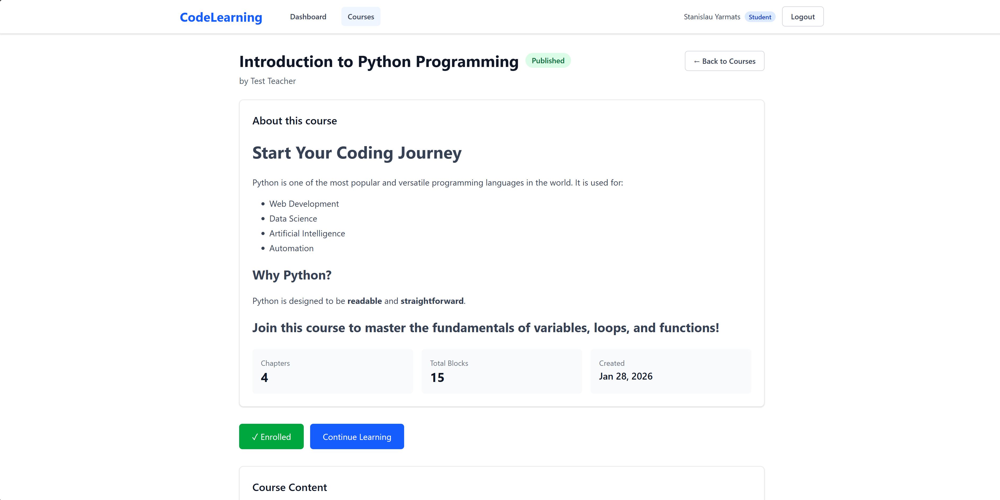

On this page you can also see course content.

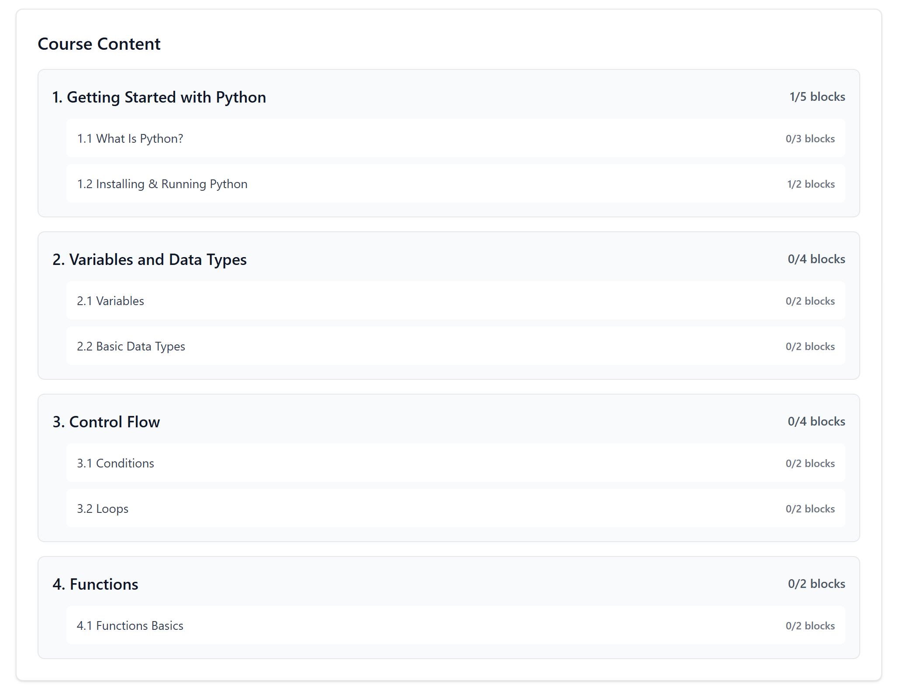

### Problem View

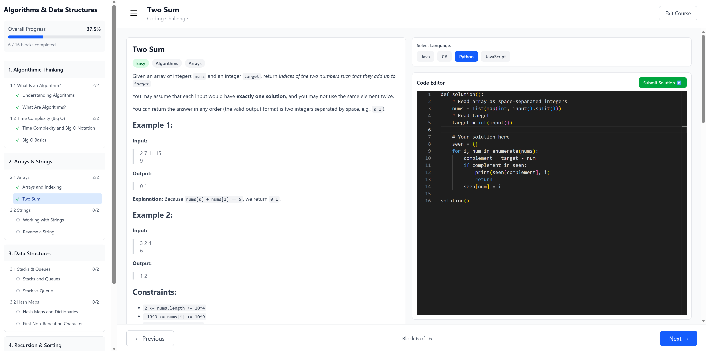

You can see history of submitions, score, view source code and so on.

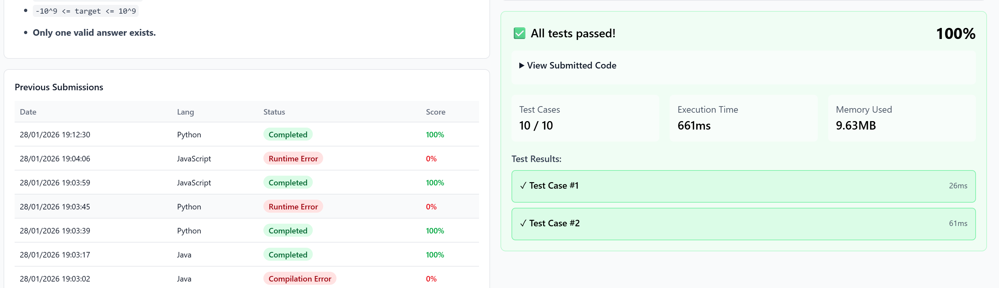

### Theory Block

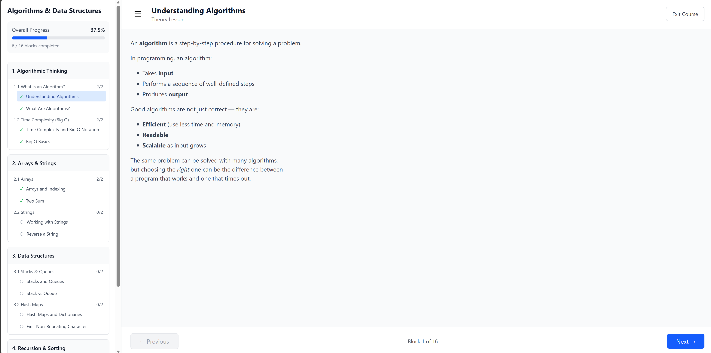

### Video Block

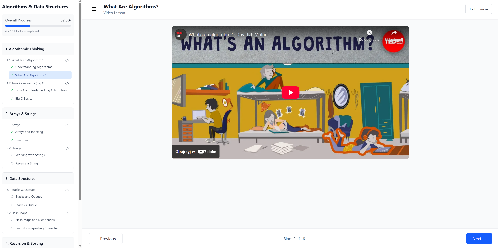

### Quiz Block

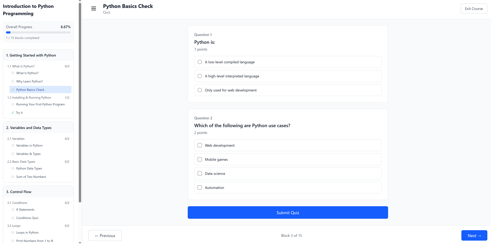

## Getting Started

### Prerequisites
* **Docker Desktop**
* **Node.js and npm**
* **.NET 10 SDK**

### Running

**Backend:**

`cd src/backend/CodeLearning.Backend`

`docker compose --profile executors up --build -d`

**Frontend:**

`cd src/frontend/codelearning-frontend`

`npm install`

`ng serve`

Frontend is on `http://localhost:4200`

Swagger is on `http://localhost:5000/swagger`

## Running Tests
The project uses **xUnit** for unit testing and **Testcontainers** for integration testing (spinning up real Postgres instances).

To run all tests:
`dotnet test src/backend/CodeLearning.Backend/CodeLearning.Tests`

Run only integration tests:
`dotnet test src/backend/CodeLearning.Backend/CodeLearning.Tests --filter "Category=Integration"`

## Security Measures (XSS & Sandbox)

- **Input Sanitization:** Uses `HtmlSanitizer` to strip dangerous tags from Markdown content on the backend before storage.

- **Auth:** Tokens are never accessible to JavaScript (`HttpOnly` cookies).

- **Runner Isolation:**

    - **Socket Security:** Uses `docker-socket-proxy` to restrict access to the Docker API (allowing only container creation/deletion), preventing full host takeover.

    - Containers run as a non-root user (`nobody`).

    - Filesystem is read-only (except tmpfs).

    - PIDs limit prevents fork bombs.

    - Network is completely disabled for user code.

